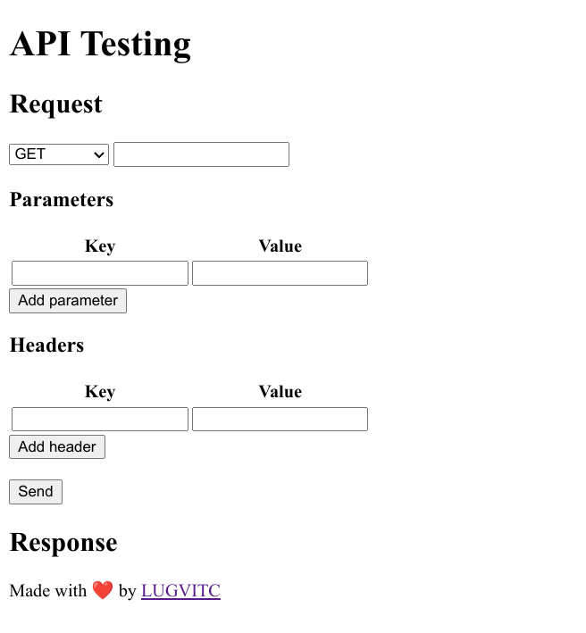

# api-testing

An API Testing tool which has the options of testing an API with all HTTP methods, HTTP headers and query parameters. Currently in the development stage, we encourage all contributors to implement features in the project.  
  
# Project structure
* **index.html** - This page displays all the functionalities available to the user currently in a single page. It has fields like :
    * `request URL` - The URL of the API which is to be tested.
    * `HTTP Method` - A dropdown containing all HTTP methods which could be used to test the request URL.
    * `Parameters` - A key-value pair which has the option to add query parameters for the HTTP request to be sent.
    * `Headers` - A key-value pair which has the option to add HTTP Headers in the request to be sent.
* **index.js** - The javascript file associated with the index.html file responsible for sending the HTTP request to the specified URL and logging its response back in the console.

# Test the project locally
* Fork the repo.
* Clone your copy of the repo to your local machine.
* Open `index.html` in a browser. 
* You should be able to see all the options currently implemented in the page.
* to be written

# Roadmap of features expected
* Add better styling to the pages. Make the UI/UX more interactive.
* Display the HTTP response obtained in a popup window after sending the request.
* Implement the option to add more than one `Headers` and `Parameters` in the webpage. Currently the project takes only one pair of header and parameter values. Create a button by its side to give the option to user to add more than one header and parameter for the HTTP request to be sent.
* Implement a history page in the project where all the HTTP requests sent by the user in the past is recorded in the form of a table.
* Implement a `star request` option which allows the user to mark a particular HTTP request as **star**. Show all starred requests at one place just like we access **starred messages** at one place.
* Implement the `bulk testing` feature in which the user can give how many times a particular request has to be sent to the API URL. It is helpful in testing globally hosted API applications. 
* Implement the `scheduled send` feature in which the user specifies at what time the particular HTTP request has to be sent to the API URL. Our code should be able to send the request at that specific time and obtain the response and store it at a separate place to show it to the user when he/she revisits the page.
* Integrate some libraries to generate statistics from bulk testing of the API. The statistics should show the success rate with which the API responded. Some sort of graphs to illustrate the testing is also welcomed. 
* Implement automatic response/error handling of requests (sending another request depending on the response).
* If you would like to implement any other feature for the project, feel free to open an issue first. After which you can create a PR to implement the same.

# Contributing
Thank you for your interest in contributing for the project. Checkout the [Contributing Guidelines](https://github.com/lugvitc/api-testing/blob/master/CONTRIBUTING.md) before submitting any PR. Submit small changes in a single PR so that it is easier to review (for instance, work on one feature in one PR). 
